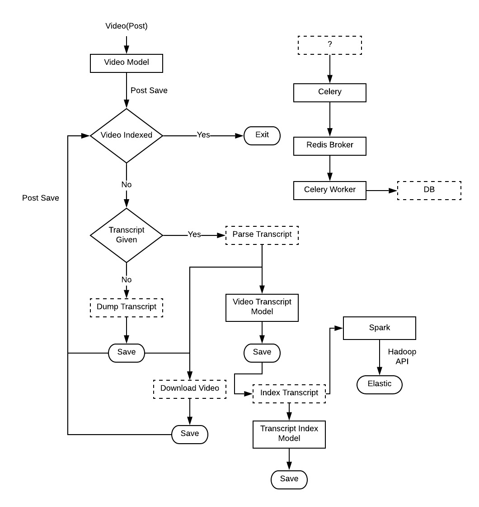
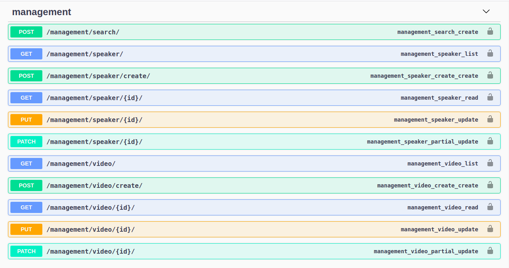
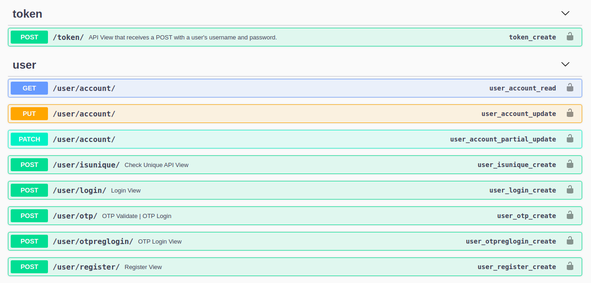

# VidSpark

[](https://github.com/ellerbrock/open-source-badges/) 
[](https://www.python.org/downloads/release/python-360/) 
[](https://opensource.org/licenses/BSD-3-Clause) 

A video repository management system powered by ***Spark*** and ***Elasticsearch***.

## Flowchart 



## Swagger API Documentation

#### Management



#### Authentication



## Installation

 1. Clone this repository: `$ git clone https://github.com/imlegend19/VidSpark.git`  
 2. Create a virtual environment: 
     ```
     $ python3 -m venv venv
     $ source venv/bin/activate
     ``` 
 3. Install the requirements: `$ pip install requirements.txt`
 4. Download & setup *elasticsearch*: `https://www.elastic.co/downloads/elasticsearch`
 5. Download & setup *Apache Spark*: `https://spark.apache.org/downloads.html`
 6. Create elasticsearch alias:
     - `$ nano ~/.bashrc`
     - Paste `alias elasticsearch='$ES_HOME/bin/elasticsearch'` at the end
     - Run `$ source ~/.bashrc`
 7. Start elasticsearch in Terminal 1: `$ elasticsearch`
 8. Setup Redis:
     - Download: `$ wget http://download.redis.io/redis-stable.tar.gz`
     - Extract: `$ tar xvzf redis-stable.tar.gz`
     - `$ cd redis-stable`
     - `$ make`
 9. Start Redis Server: `$ redis-server`
 10. Check if redis is working:
     ```
     $ redis-cli ping
     PONG
     ```
 11. `$ cd VidSpark` 
 12. Start celery in Terminal 2: `$ celery -A VidSpark worker --loglevel=info`
 13. (Optional) Start flower in Terminal 3: `$ celery -A VidSpark flower`
     - Go to `http://localhost:5555/` to view the background tasks status.
 14. Run migrations:
     - `$ python manage.py makemigrations`
     - `$ python manage.py migrate`
 15. Create a superuser:
     - `$ python manage.py createsuperuser`
     - The superuser is not active by default! Open `drf_user_user` table and set `active=1` for the newly created user.
 16. Bingo! The setup is now complete.
 
Start the Django Server: `$ python manage.py runserver`

Admin Panel: `http://localhost:8000` 
API Documentation: `http://localhost:8000/swagger`

> **Note:**
> Some API's need authorization. Send a `POST` request to `http://localhost:8000/api/token/`. Also, note that only
> user's registered to the system can get the token.

